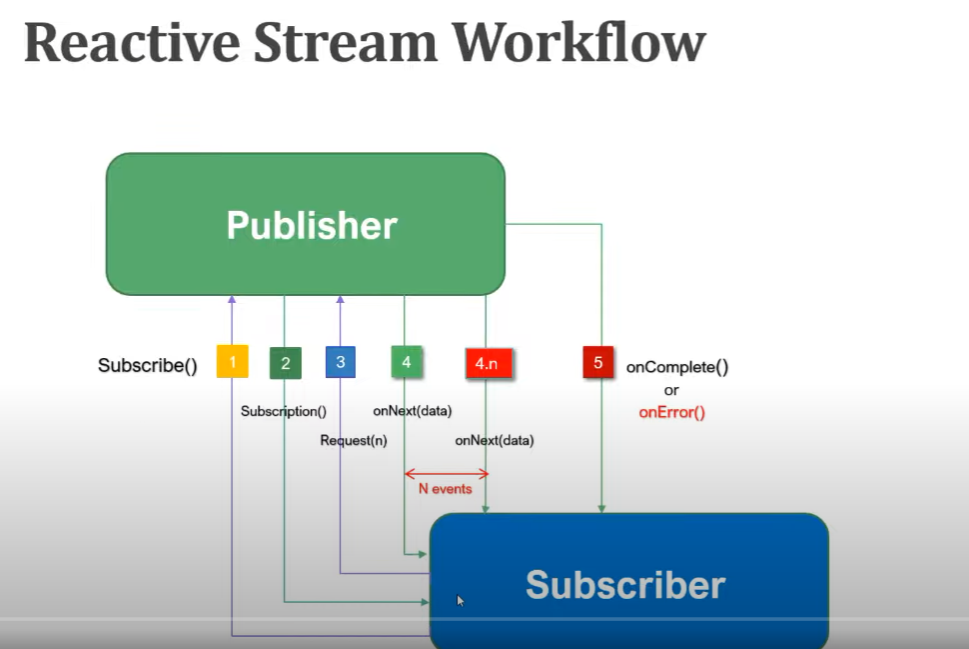

# Spring boot Reactive Programming

- Spring 5 provides Spring WebFlux which helps to create web application that helps to create reactive web applications.

## Asynchronous and non blocking

    Be can handle more request(using pub-sub model)

## Funtional Style coding

    Use more lambdas

## Data flow as event driven stream

    Data is transfer as event driven ---whenever changes happen pubhlisher publish the event

## Backpressure on data streams

Add limitation on data from database

---

## Reactive Programming

Reactive programming is a programming paradigm where the focus is on developing **_asynchronous_** and **_non-blocking_** applications in an event-driven form.

## Four Interfaces

Publisher

```java
    interface Publisher<T>
    {
            public void subsribe(Subscribe<? super T>s)
    }
```

Subsriber

```java

    interface Subsriber<>{

        onSubscribe(Subscription s)
        onNext(T t)
        onError(Throwable t)
        onComplete()

    }

```

Subscription

```java
interface Subscription{
    cancel()
    request(long var)
}

```

Processor

## Reactive stream flow



## Libraries for reactive programming

- Reactor
- RxJava
- Jdk9 Flow Reactor Stream

# Project Reactor

Project reactor is library that implements reactive specification for building non-blocking and asynchronous applications on JVM

### Implementation of Publisher

- Flux - 0...N elements

- Mono - return 0 or 1 element

---

- Creating Mono and Flux

```java

Mongo<String> mono=Mono.just("data")

```

- Error

```java
Mono.just("data").then(Mono.error(new RuntimeException("ERROR")))
```

- zip()
  merge mono provide Mono of Tuple
- withZip()

combines the result from this mono and another mono.

```java

  var m1=Mono.just("First");
        var m2=Mono.just("Second");
        Mono<Tuple2<String, String>> tuple2Mono = m1.zipWith(m2);

        tuple2Mono.subscribe(values->{
            System.out.println(values.getT1());
            System.out.println(values.getT2());
        });


```

- map()

transform the value emmited by current using syn function

```java

      var m1 = Mono.just("First Project working");
      var m2 = Mono.just(124);

      Mono<String> changeMono = m1.map(item -> item.toUpperCase());
      changeMono.subscribe(System.out::println);

```

- flatMap() and flatMapMany()

- flatMap() - transform the value emmited by current mono async, returning the value emmited by another mono (change value type possible )

- flatMapMany() - transform this mono into publisher , then change to return a many value that is Flux.

```java
    var m1 = Mono.just("First");
    var m2 = Mono.just(124);

    Mono<String> integerMono = m1.flatMap(item1 -> m2.map(item2 -> item2.toString().concat(item1)));
    integerMono.subscribe(System.out::println);


```

```java
var m1 = Mono.just("First Project working");
var m2 = Mono.just(124);

```

- concatWith()

join to mono and provide Flux

```java
  Flux<String> secondString = m1.concatWith(Mono.just("second string"));
```

- deleyElement()
  to provide delay on onNext()

  ***

  ## Flux Operators

1. map
2. filter
3. flatMap(flatMapMany(mono to flux))
   mapping convert each element to flux of element.(Asynchronous)

4. concatMap

   preserve the order

5. delayElements- delay the elements

6. transform -- take functional interface to transform the data

7. defaultIfEmpty-->
   provide the default data if empty

   defaultIfEmpty(pass the default value)

8. switchIfEmpty-

   switch to new set of data
   switchIfEmpty(passflux)

9. concat(static) & concatWith(instance method)
   (sync)

10. merge & and mergeWith
    (async)

11. mergeSequential

working with different type reactive type

12. zip & zipWith

    ```java

    Flux.zip(flux1,flux2,(first,second)->{
        return first+second;
    }).log()

    ```

SideEffect operators -> dont change the actual behaviour

13. onDoNext()
    - when next is called
14. doOnSuscribe()
    - when subscribe

Exception Handling
